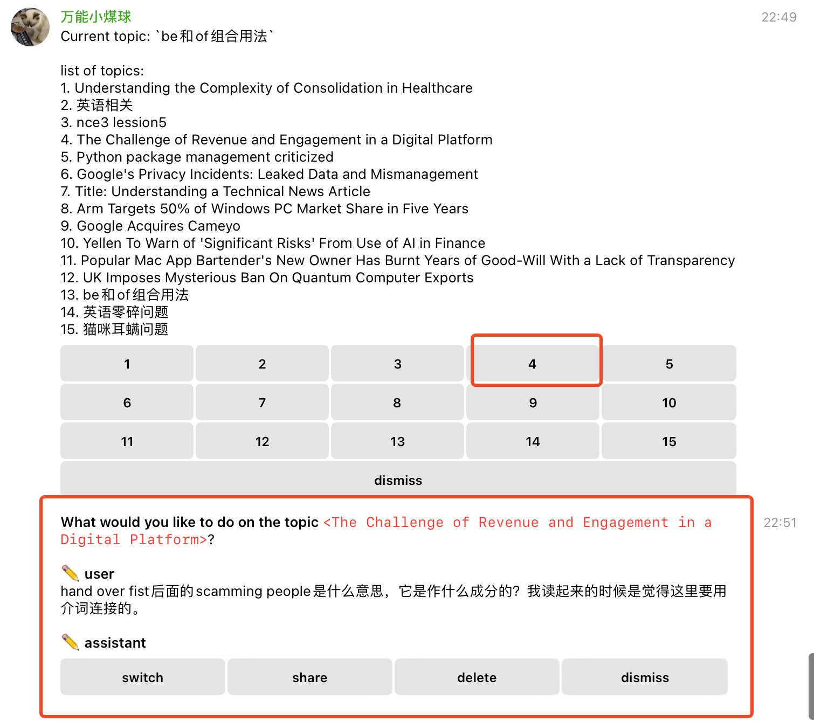
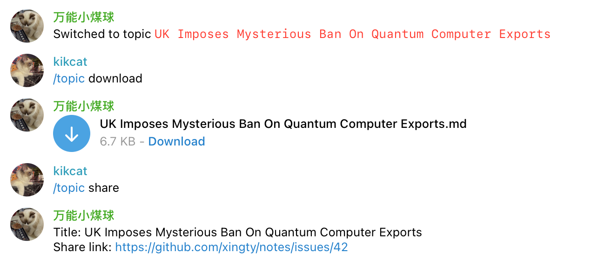

# CatGPT 

CatGPT is a Telegram bot that integrates with OpenAI's api for people who like to use OpenAI in Telegram.

### Features
* Multiple topics
  
 * Multiple endpoints

 * Powerful and easy to use


### Installation

* Install from source code

  ```shell
  git clone https://github.com/xingty/CatGPT
  cd CatGPT
  ```
  
  pip: 
  
  ```shell
  pip3 install -r requirements.txt
  
  python3 start.py --config ${config_file}
  ```
  
  pdm:
  
	  ```shell
	  pdm install
	  pdm run start.py --config ${config_file}
	  ```

* Install from release files

  Download the latest build at [Release](https://github.com/xingty/CatGPT/releases)
  
  ```shell
  pip3 install mqgpt-${version}-py3-none-any-whl
  mqgpt --config ${config_file}
  ```


 ### Commands

 * /key `{access key}`

   The `access key` is the key configured in the config file `config.json`

   You will be enrolled into the system if a correct access key is supplied

 * **/list**

   Display all topics in the **current chat window**. This indicates that the chat histories for Private Chats, Channels, and Groups are kept separate.

   

   You can click a button to view the next step you can take.

   

   As you see, you can share, download, or delete the topic on which you clicked

 * /new `[title]`

   Create a new topic with the given title. 

   For example, using `/new english learning` will create a topic with the title `english learning`. A default title will be used if you do not supply a specific title.

   

* **/topic** `[share | download | title]`

  There are three optional operations that you can use to perform some task quickly.

  * `share`

    Use `/topic share` to share the topic directly without a confirmation operation

  * `download`

    Use `/topic download` to download the topic's content directly without a confirmation operation. The content will be encoded as Markdown file
	  
  * **other characters**

    Any other characters will be treated as the title, and the topic's title will be updated."
	

​		

​	if none of the operations is supplied, it displays the chat history.

​		

* **/profile**

  Display user's profile (including the current endpoint, model, and topic)

* **/endpoint** `[endpoint name]`

  Display all endpoints.

​	You can also swtich to an endpoint directly with the command `/endpoints [your endpoint name]`

* **/model** `[model name]`

  Display all the support models of the endpoint.

  Use `/model [model name]` to switch to it directly. Otherwise, the list of models will be displayed in the  chat window.

  There are some short names that map to the full names of those models

  ```json
  {
      "gpt4": "gpt-4",
      "gpt4_32k": "gpt-4-32k",
      "gpt4_16k": "gpt-4-16k",
      "0314": "gpt-4-0314",
      "0613": "gpt-4-0613",
      "1106": "gpt-4-1106-preview",
      "0125": "gpt-4-0125-preview",
      "0409": "gpt-4-turbo-2024-04-09",
      "gpt4o": "gpt-4o",
    	"4o": "gpt-4o"
  }
	```
	For example, you can use `/model 0409` to switch to the model `gpt-4-turbo-2024-04-09` directly.
	
	
	
	It displays all the models if a invalid short name is provided.
	
* **/revoke**

  Removes the latest messages from the chat window and chat histories so that you can have another attempt.

* **/clear** `[history | all]`

  Clears all the messages of the topic
  
  * `history`: Only clear the chat history, messages are remained in the chat window.
  * `all`: Clears both chat history and messages.

* **/respond** `[y|yes|n|no]`

  if enable, the bot will respond to all the group messages.

  This command is **only granted** to the group owner or adminstrators.


### CLI

```shell
usage: mqgpt [-h] --config CONFIG [--preset PRESET] [--db-file DB_FILE]

options:
  -h, --help       show this help message and exit
  --config CONFIG  Config file
  --preset PRESET  preset file
  --db-file DB_FILE  database file
```

### Configuration

* `tg_token`: the token of your telegram bot

* `access_key`: access key

* `proxy`: a http or https proxy server. the chatbot will run behind the proxy server if it's supplied

* `respond_group_message`: If true, the bot will respond to group messages even if it is not mentioned.  default: `false`, can be changed at runtime using the command `/respond` in groups.

* `endpoinds`: your endpoints

  endpint:

  * `name`: endpoint name
  * `provider`:  **openai** or **gemini**
  * `api_url`: api url. e.g. `https://api.openai.com/v1`
  * `secret_key`: secret_key
  * `models`: list of supporting models of this endpoint
  * `generate_title`: If `true`, the endpoint will be used to automatically generate titles for topics that lack one, based on their chat history."

* `share`: a share provider(only supports github currently)

  * name: `require`, an identification of your provider
  * type: `github`
  * repo: the repo name of your github accout 
  * owner: github username
  * token: your github personal token


```json
{
  "tg_token": "YOUR_TELEGRAM_BOT_TOKEN",
  "access_key": "Specify Access Key to use this bot",
  "proxy": "http://proxy:port",
  "respond_group_message": false,
  "share": [
    {
      "name": "notes",
      "type": "github",
      "repo": "name of your repo",
      "owner": "github username",
      "token": "your github personal token"
    }
  ],
  "endpoints": [
    {
      "name": "endpoint_1",
      "api_url": "https://api.openai.com",
      "secret_key": "YOUR_API_KEY",
      "provider": "openai",
      "models": [
        "gpt-4o",
        "gpt-4-turbo-2024-04-09",
        "gpt-4-0125-preview",
        "gpt-4-1106-preview",
        "gpt-4"
      ]
    }
  ]
}
```


### Preset

You can specific your own preset file.

```json
[
  {
    "role": "ai",
    "prompt": "you are a helpful assistant."
  },
  {
    "role": "translator",
    "prompt": "you are a translator."
  }
]
```


### Using in Telegram group that enables topics

Each topic in a group has its own profile, it means that all configuration in topics are isolated. 


### How to create a telegram bot

1. Talk to [BotFather](https://t.me/BotFather)
2. Use the command `/newbot` to create a new bot
3. Follows the guideline of BotFather and then get the access token of your bot


### Thanks

The idea of this project was inspired by YiHong0618's **[tg_bot_collections](https://github.com/yihong0618/tg_bot_collections)**, thanks a lot for [YiHong0618](https://github.com/yihong0618).


### Buy me a coffee

爱发电：[](https://afdian.net/a/versatile_mq)


### License

MIT
